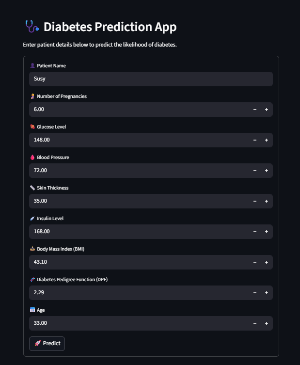

# 🩺 Diabetes Prediction: Research & Deployment System


## 📌 Overview
This repository serves a dual purpose, bridging the gap between academic research and practical software deployment:

1.  **Research Phase (`.ipynb`):** A strict replication of a specific medical study on diabetes prediction using **Random Forest**, **SMOTE**, and **Global Scaling**.
2.  **Deployment Phase (`.py`):** A modular web application built with **Streamlit** that serves the trained model to end-users in a user-friendly interface.

---

## ⚠️ Academic Methodology Disclaimer
**Please Read Before Reviewing the Research Notebook:**

To ensure the results match the cited reference paper, the **Jupyter Notebook (`ml-prediction-diabetic-code.ipynb`)** follows a specific preprocessing workflow:

* **Global Scaling:** `MinMaxScaler` is applied to the *entire dataset* before splitting.
* **Global SMOTE:** Oversampling is applied to the *entire dataset* before splitting.

**Methodology Note:** I am fully aware that applying these techniques before the Train-Test split introduces **Data Leakage** and is not standard industry practice. However, this was done intentionally to reproduce the exact metrics reported in the academic paper being studied.

---

## 📂 Project Architecture
This project moves beyond a simple notebook by implementing a **Modular Architecture** for deployment. The logic is separated into distinct responsibilities:

```text
├── app/                                   # 💻 APPLICATION SOURCE CODE
│   ├── app.py                             # Main Streamlit application
│   ├── model.py                           # Backend logic & inference
│   └── preprocess.py                      # Utils for input formatting
├── assets/                                # 🖼️ STATIC ASSETS
│   └── diabetes_app_ui.png                # App Screenshot
├── models/                                # 📦 ARTIFACTS (Serialized Objects)
│   ├── scaler.joblib                      # Saved MinMaxScaler
│   └── model_rf.joblib                    # Saved Random Forest Model
├── notebooks/                             # 🔬 RESEARCH & EXPERIMENTATION
│   └── ml-prediction-diabetic-code.ipynb  # Replicated Research Study
└── requirements.txt                       # Dependency list
````

## 🛠️ Tech Stack

  * **Frontend Framework:** Streamlit
  * **Machine Learning Core:** Scikit-Learn (Random Forest Classifier)
  * **Data Handling:** Pandas, NumPy, Joblib
  * **Imbalanced Data:** Imbalanced-learn (SMOTE)
  * **Environment:** Python 3.x

## 🚀 How to Run Locally

### 1. Clone the Repository

```bash
git clone [https://github.com/viochris/Diabetes-prediction-project.git](https://github.com/viochris/Diabetes-prediction-project.git)
cd Diabetes-prediction-project
```

### 2. Install Dependencies

Make sure you have the required libraries installed:

```bash
pip install streamlit scikit-learn pandas numpy joblib imbalanced-learn matplotlib seaborn
```

### 3. Run the Streamlit App

Execute the main application file:

```bash
streamlit run app.py
```

### 4. Access the Dashboard

Open your browser and navigate to:
`http://localhost:8501`

## 📊 Research Results

Based on the replication study conducted in the notebook:

  * **Algorithm:** Random Forest Classifier
  * **Accuracy:** *(Update with your notebook result, e.g., 98.5%)*
  * **Precision:** *(Update with your notebook result)*
  * **Recall:** *(Update with your notebook result)*

## 📷 Screenshots
### Web Application Interface
User-friendly interface built with Streamlit allowing for real-time patient data input and instant prediction:


*(Pastikan path 'assets/' dihapus kalau kamu taruh gambarnya bareng sama file README)*

-----

**Author:** [Silvio Christian, Joe](https://www.linkedin.com/in/silvio-christian-joe)
*"Bridging the gap between Academic Research and Practical Deployment."*
